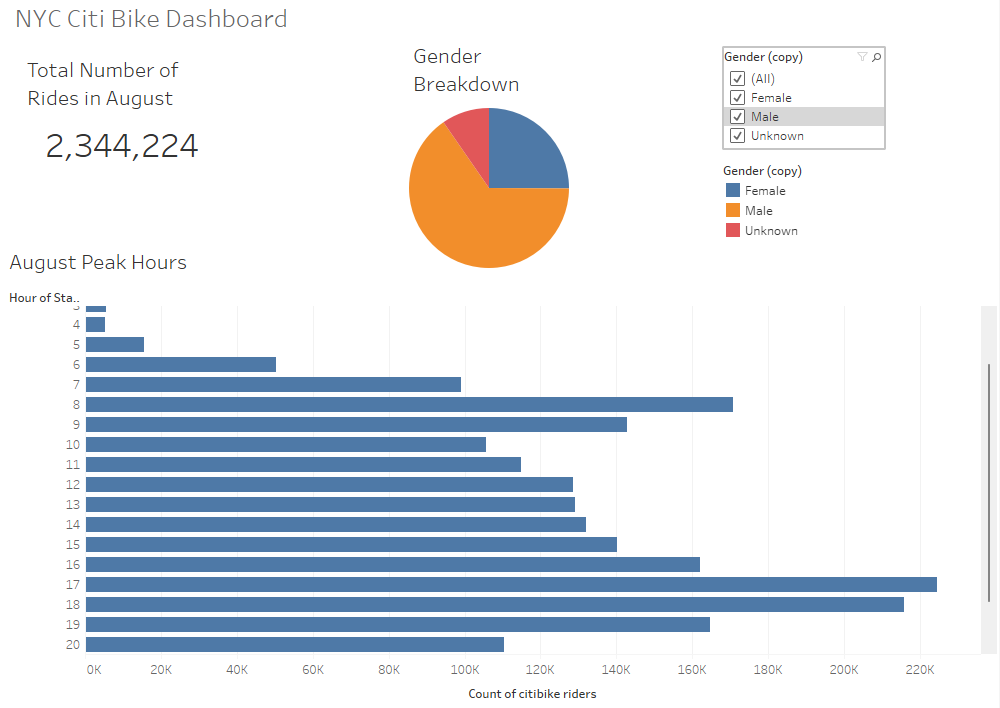
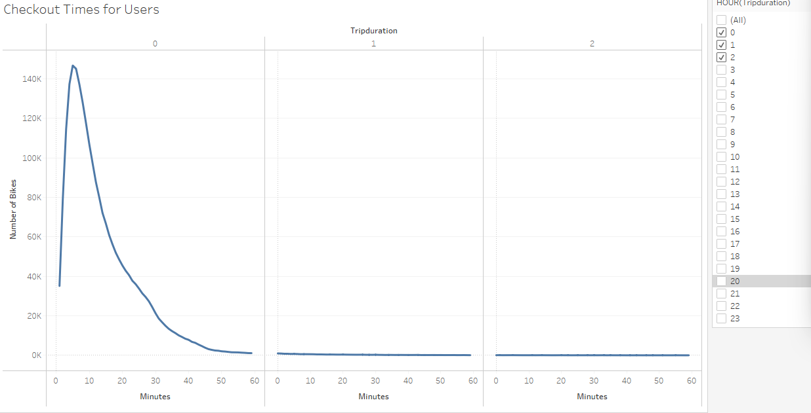
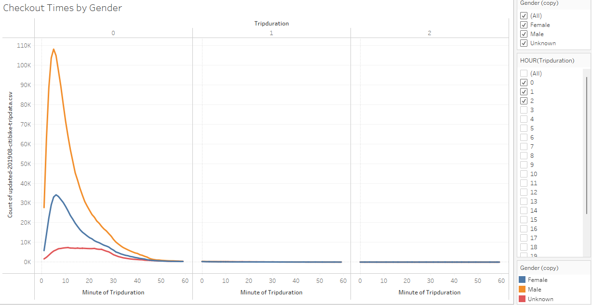
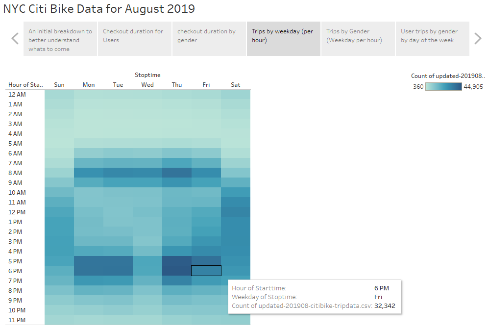
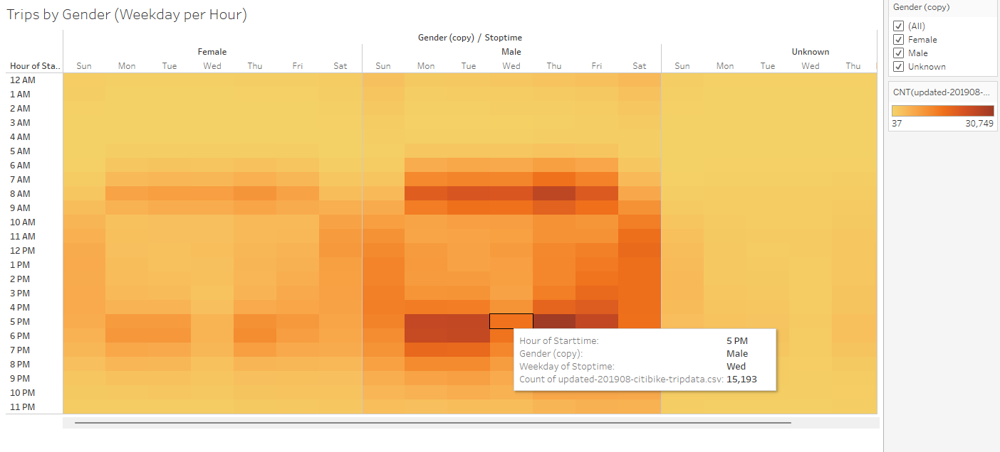
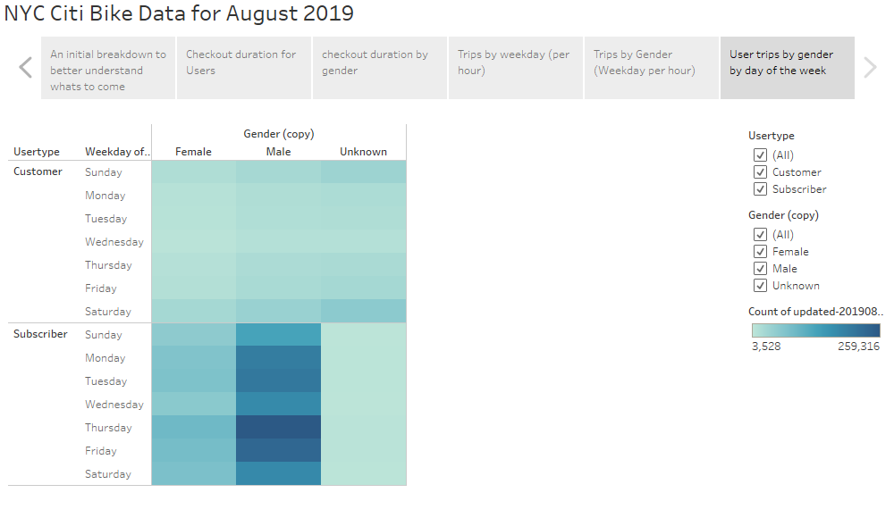

# Citi Bike Bikesharing Analysis

## Overview

The purpose of this analysis was to determine whether investing into the expansion of a bike-sharing program in the city of Des Moines would be beneficial and profitable. To provide a presentation, data was used from Citi Bike for the month of August in NYC. With this data I can provide a little more detail into whether or not this is a BOOMING business. 

## Results

Dashboard

The first things we need to learn before we continue exploring the data can be found on the Dashboard. Here we have 3 different charts that help us get a gauge of how the bikes are used. The total number of bike rides for the month of August was 2,344,224. We can see that there are 3 times more male riders than female riders for the month as well. Finally, this chart breaks down the usage by the hour in the day. 

Checkout times for Users

This image shows how long users check bikes out. As we can see, users typically ride for a few minutes at time, with peak users at 5 minutes. 

Checkout time by gender

This next chart shows that there is a much higher population of Males that checkout the bikes. 108k males to 34k females.

Trips by Weekday per hour

This chart shows that the bikes are checked out at 8 am during the week and again another heavy flow between 5 and 6. This could be attributed by users work schedule. It would make a great way to get to work every day. 

Trips by Gender

This chart separates the trips by gender. As we can see there is still a direct correlation to work hours for both male and females. Although there is something interesting happenining on Wednesays as both genders don't appear to checkout bikes very much that day.

Trips by gender per day

Separating users and subscribers we see that subscribers use the bikes much more than average users. Again we see the correlation of more usage during the week. 

## Summary

In conclusion, while reviewing the charts we can see that there is a lot of usage coming from these bikes. We can also get a good understanding that the majority users appears to be males. On top of all of that, these bikes arent just used for leisure; We can confidently see a connection with riders using the bikes as a mean of transportation. The ultimate goal of this analysis was to see if this would work for Des Moines. To get a solid answer on this, I would suggest we create charts to see how the bikes work outside of NYC. since the city is so congested, bikes are only rented out for 5 minutes on average. We need to see how this will work for Des Moines, but checking another city that is more spread out, somewhere like Salt Lake City would seem to be a good choice for another analysis.

If you would like to play with the visualizations that I have explained, please follow the link [HERE](https://public.tableau.com/app/profile/kmomolina/viz/citibikeChallenge_16767961952110/NYCCitiBikeDataforAugust2019) to the tableau.